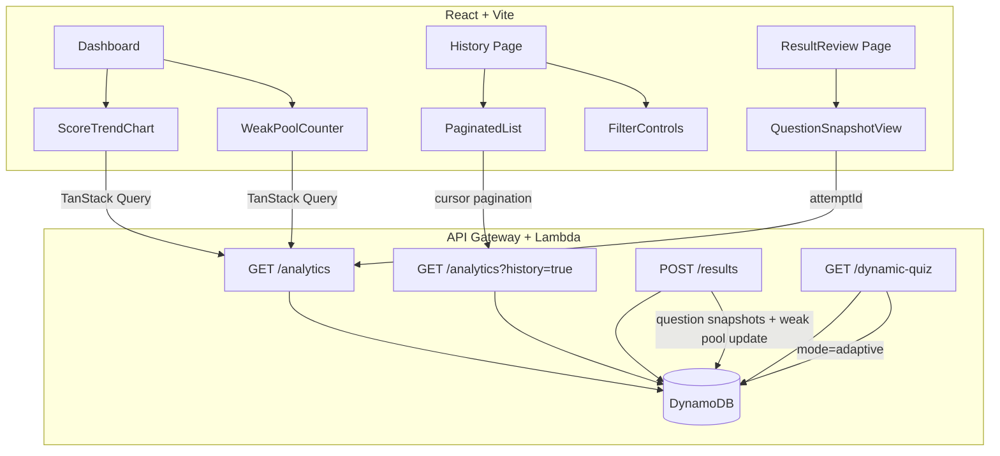

# Design Document: Study Mode Enhancements

## Overview

This design covers five interconnected enhancements to CertPrep360's study mode: score trend visualization, question snapshot storage in attempt records, spaced repetition via a Leitner box system, multi-domain adaptive quiz selection, and paginated/filterable history. These features transform the platform from a stateless exam simulator into a data-driven learning system that adapts to each user's weaknesses.

The architecture extends the existing single-table DynamoDB design, adds new response shapes to the Analytics API, enhances the Dynamic Quiz API with adaptive mode, and introduces new React components on the frontend using the existing Recharts/Tremor + TanStack Query + Zustand stack.

## Architecture



### Key Architectural Decisions

1. **Single Lambda per endpoint** — Extend existing `get-user-analytics`, `submit-results`, and `get-dynamic-quiz` Lambdas rather than creating new ones. This keeps the API surface small and avoids cold-start multiplication.

2. **DynamoDB single-table continuation** — All new data (Weak_Pool, enhanced attempts) lives in the same `CertPrep360-Dev-Main` table using new SK patterns. No new GSIs required.

3. **Server-side pagination and filtering** — The Analytics API handles pagination/filtering via DynamoDB Query with `ExclusiveStartKey` cursor, avoiding loading all attempts into memory.

4. **Question snapshots stored inline** — Snapshots are stored directly in the attempt item with a size guard and truncation strategy to stay under 400KB.

5. **Weak Pool updated on submit** — The `submit-results` Lambda atomically updates the Weak_Pool item when results are submitted, avoiding a separate write path.

6. **Recharts via Tremor** — Use Tremor's `LineChart` component (which wraps Recharts) for the score trend chart, consistent with the existing dependency.

## Components and Interfaces

### Backend Components

#### 1. Enhanced `submit-results` Lambda

**Responsibilities:**
- Accept question snapshots in the request body
- Validate total item size < 400KB; truncate explanations if needed
- Write the attempt record with snapshots
- Update the user's Weak_Pool item (add incorrect questions to Box 1, promote/demote existing entries)

**Interface:**
```typescript
// POST /results request body
interface SubmitResultsRequest {
  examId: string;
  certId: string;
  score: number;
  timeTaken: number;
  answers: Record<string, DetailedAnswer>;
  questionSnapshots?: QuestionSnapshot[]; // NEW
}

interface QuestionSnapshot {
  q_id: string;
  text: string;
  options: Record<string, string>; // { A: "...", B: "...", ... }
  correct: string;
  explanation: string;
  domain: string;
}

interface DetailedAnswer {
  q_id: string;
  domain: string;
  selected: string | null;
  isCorrect: boolean;
}
```

#### 2. Enhanced `get-user-analytics` Lambda

**Responsibilities:**
- Return trend data (all attempts with scores, certId, domains)
- Support paginated history retrieval with cursor
- Support server-side filtering (certId, pass/fail status) and sorting
- Return Weak_Pool summary count
- Return per-domain accuracy per attempt for domain trend lines

**Interface:**
```typescript
// GET /analytics — dashboard summary (existing + new fields)
interface AnalyticsResponse {
  examsCompleted: number;
  averageScore: number;
  totalStudyHours: number;
  weakestDomain: string;
  certificationsTracked: string[];
  weakPoolCount: number; // NEW
  trendData: TrendDataPoint[]; // NEW
  recentAttempts: AttemptSummary[];
}

interface TrendDataPoint {
  date: string; // ISO timestamp
  score: number;
  certId: string;
  examId: string;
  domainScores: Record<string, number>; // domain -> accuracy %
}

// GET /analytics?history=true&pageSize=20&cursor=xxx&certId=SAA-C03&status=failed&sort=score_desc
interface PaginatedHistoryResponse {
  attempts: AttemptSummary[];
  totalCount: number;
  nextCursor: string | null;
}

interface AttemptSummary {
  id: string;
  examId: string;
  certId: string;
  score: number;
  date: string;
  timeTaken: number;
  passed: boolean;
}
```

#### 3. Enhanced `get-dynamic-quiz` Lambda

**Responsibilities:**
- Support `mode=adaptive` parameter for multi-domain selection
- Query user's domain performance to identify 2-3 weakest domains
- Distribute questions using inverse performance weighting
- Mix in Weak_Pool questions based on Leitner scheduling
- Accept explicit domain list as alternative to adaptive mode

**Interface:**
```typescript
// GET /dynamic-quiz?mode=adaptive&certId=SAA-C03&limit=20
// GET /dynamic-quiz?domain=Design+Resilient+Architectures,Security&certId=SAA-C03&limit=20
// GET /dynamic-quiz?domain=Design+Resilient+Architectures&certId=SAA-C03&limit=20 (existing)

interface DynamicQuizResponse {
  mode: 'single-domain' | 'adaptive' | 'multi-domain';
  domains: string[];
  count: number;
  totalAvailable: number;
  weakPoolIncluded: number; // count of spaced-repetition questions mixed in
  questions: CleanQuestion[];
}
```

### Frontend Components

#### 1. `ScoreTrendChart` (new component)

- Uses Tremor `LineChart` with multiple series (one per certification)
- Horizontal reference line at 72% pass threshold
- Tooltip with score, cert, exam ID, date
- Certification selector to drill into per-domain lines
- Domain line toggle checkboxes

#### 2. `WeakPoolCounter` (new component)

- Simple stat card on Dashboard showing total Weak_Pool question count
- Links to a "Start Review Quiz" action

#### 3. Enhanced `ResultReview` page

- Renders `QuestionSnapshotView` for attempts with snapshots
- Filter tabs: All / Correct / Incorrect / Skipped
- Reveal/hide toggle per question for answer + explanation
- Keyboard navigation (← → arrow keys)
- Graceful fallback for legacy attempts without snapshots

#### 4. Enhanced `History` page

- Infinite scroll with cursor-based pagination via TanStack Query's `useInfiniteQuery`
- Filter dropdowns: certification, pass/fail status
- Sort selector: newest, oldest, highest score, lowest score
- Total count + filtered count display
- Loading skeleton during page fetches

## Data Models

### DynamoDB Item Patterns

#### Attempt Record (enhanced)

| Attribute | Value | Notes |
|-----------|-------|-------|
| PK | `USER#<userId>` | Partition key |
| SK | `ATTEMPT#<timestamp>#EXAM#<examId>` | Sort key (existing pattern) |
| certId | `SAA-C03` | |
| examId | `exam-1` | |
| score | `78` | Percentage |
| timeTaken | `45` | Minutes |
| answers | `{ "0": { q_id, domain, selected, isCorrect }, ... }` | Existing |
| questionSnapshots | `[ { q_id, text, options, correct, explanation, domain }, ... ]` | **NEW** — array of snapshots |
| domainScores | `{ "Design Resilient Architectures": 80, ... }` | **NEW** — pre-computed per-domain % |
| timestamp | ISO string | |
| type | `EXAM_ATTEMPT` | |

**Size budget:** A 65-question exam with ~200 chars per question text, 4 options × 80 chars, 300 chars explanation ≈ 65 × (200 + 320 + 300 + 50) = ~56KB. Well within 400KB. Truncation only needed for exams with very long explanations.

#### Weak Pool Record

| Attribute | Value | Notes |
|-----------|-------|-------|
| PK | `USER#<userId>` | |
| SK | `WEAK_POOL#<certId>` | One item per user per certification |
| questions | Map of q_id → WeakPoolEntry | |
| sessionCounter | `number` | Incremented each quiz session |
| updatedAt | ISO string | |
| type | `WEAK_POOL` | |

```typescript
interface WeakPoolEntry {
  box: 1 | 2 | 3;
  addedAt: string;       // ISO timestamp
  lastReviewed: string;  // ISO timestamp
  domain: string;
  certId: string;
}
```

**Size consideration:** Each entry is ~150 bytes. A user with 200 weak questions = ~30KB. Well within 400KB.

#### Weak Pool Scheduling Logic

| Box | Review Frequency | Condition |
|-----|-----------------|-----------|
| Box 1 | Every session | Always included in quiz |
| Box 2 | Every 3 sessions | `sessionCounter % 3 === 0` |
| Box 3 | Every 7 days | `now - lastReviewed >= 7 days` |

### API Query Patterns

| Operation | DynamoDB Access | Pattern |
|-----------|----------------|---------|
| Get all attempts (paginated) | Query PK=USER#id, SK begins_with ATTEMPT#, Limit + ExclusiveStartKey | Cursor = base64(LastEvaluatedKey) |
| Get attempt count | Query with Select=COUNT | For total count header |
| Get Weak Pool | GetItem PK=USER#id, SK=WEAK_POOL#certId | Single item read |
| Update Weak Pool | UpdateItem with SET expressions | Atomic update on submit |
| Filter by certId | Query + FilterExpression on certId | Server-side filter |
| Filter by pass/fail | Query + FilterExpression `score >= 72` or `score < 72` | Server-side filter |
| Sort by score | Query all + in-memory sort (DynamoDB sorts by SK only) | For score sort, fetch page + sort in Lambda |

### Pagination Strategy

- **Cursor-based** using DynamoDB's `LastEvaluatedKey`
- Cursor is base64-encoded JSON of `{ PK, SK }` — opaque to the client
- Default page size: 20, max: 50
- For date sorting (default): DynamoDB's native SK ordering works directly (ATTEMPT#timestamp sorts chronologically)
- For score sorting: Lambda fetches a larger batch, sorts in memory, and returns the requested page size. This is acceptable because individual user attempt counts are bounded (typically < 500).

## Correctness Properties

*A property is a characteristic or behavior that should hold true across all valid executions of a system — essentially, a formal statement about what the system should do. Properties serve as the bridge between human-readable specifications and machine-verifiable correctness guarantees.*

### Property 1: Trend data is chronologically ordered and complete

*For any* set of user attempt records stored in DynamoDB, the Analytics API trend data response SHALL return all attempts sorted by timestamp in ascending order, and each entry SHALL contain score, certId, examId, and timestamp fields.

**Validates: Requirements 1.6**

### Property 2: Per-domain accuracy computation

*For any* attempt record containing answers with domain and isCorrect fields, the computed domainScores map SHALL have each domain's value equal to `(correct answers in domain / total answers in domain) * 100`, rounded to the nearest integer.

**Validates: Requirements 2.1**

### Property 3: Distinct trend series per certification

*For any* set of trend data points containing N distinct certId values, the chart data transformation SHALL produce exactly N distinct series, one per certification.

**Validates: Requirements 1.3**

### Property 4: Question snapshot persistence with size enforcement

*For any* valid set of question snapshots submitted with exam results, the stored attempt record SHALL preserve all question text, options, and correct answer fields unchanged, AND the total serialized item size SHALL be less than 400KB. If the original payload exceeds 400KB, explanation fields SHALL be truncated while all other snapshot fields remain intact.

**Validates: Requirements 3.1, 3.2, 3.3**

### Property 5: ResultReview filter correctness

*For any* set of question answers with mixed correctness and skipped status, applying the "correct" filter SHALL return only answers where isCorrect is true, applying the "incorrect" filter SHALL return only answers where isCorrect is false and selected is non-null, and applying the "skipped" filter SHALL return only answers where selected is null.

**Validates: Requirements 4.1**

### Property 6: Leitner box state transitions

*For any* question in the Weak_Pool at box level B, answering correctly SHALL move it to box B+1 (or remove it if B=3), and answering incorrectly SHALL move it to box 1. For any question not in the Weak_Pool that is answered incorrectly, it SHALL be added to box 1.

**Validates: Requirements 5.1, 5.2, 5.3, 5.4**

### Property 7: Spaced repetition scheduling

*For any* Weak_Pool state with a given session counter and current timestamp, the scheduling function SHALL include all Box 1 questions, SHALL include Box 2 questions if and only if sessionCounter mod 3 equals 0, and SHALL include Box 3 questions if and only if the time since lastReviewed is greater than or equal to 7 days.

**Validates: Requirements 6.1, 6.2, 6.3**

### Property 8: Adaptive domain selection with inverse weighting

*For any* domain performance map with 3 or more domains, the adaptive selection algorithm SHALL select the 2-3 domains with the lowest accuracy, and SHALL allocate questions inversely proportional to accuracy (a domain with half the accuracy of another SHALL receive approximately double the questions).

**Validates: Requirements 7.1, 7.2**

### Property 9: Minimum questions per domain invariant

*For any* adaptive quiz generation with a total question limit >= 2 × number of selected domains, each selected domain SHALL receive at least 2 questions in the final allocation.

**Validates: Requirements 7.3**

### Property 10: Explicit domain selection

*For any* quiz request specifying explicit domain names, all returned questions SHALL belong to one of the specified domains, and no questions from unspecified domains SHALL be included.

**Validates: Requirements 7.4**

### Property 11: Pagination completeness

*For any* set of N user attempts and a page size P, iterating through all pages using the returned nextCursor values SHALL eventually retrieve all N attempts with no duplicates and no omissions, and each page SHALL contain at most P items.

**Validates: Requirements 8.1, 8.2, 8.3**

### Property 12: Server-side filtering and sorting

*For any* set of user attempts and any combination of certId filter, pass/fail status filter, and sort order, the API response SHALL contain only attempts matching all active filters, and SHALL be ordered according to the specified sort (newest, oldest, highest score, or lowest score).

**Validates: Requirements 9.3, 9.6**

## Error Handling

### Backend Error Scenarios

| Scenario | Handling | HTTP Status |
|----------|----------|-------------|
| Missing auth token | Return 401 Unauthorized | 401 |
| Missing required fields (examId, score) | Return 400 with field list | 400 |
| Attempt record exceeds 400KB after truncation | Log warning, store without explanations | 201 (degraded) |
| Weak_Pool item not found on update | Create new item with initial state | 201 |
| DynamoDB throttling | Retry with exponential backoff (SDK default) | 500 on exhaustion |
| Invalid cursor parameter | Return 400 with "invalid cursor" message | 400 |
| Invalid filter/sort parameters | Ignore invalid params, use defaults | 200 |
| Attempt not found by ID | Return 404 | 404 |

### Frontend Error Scenarios

| Scenario | Handling |
|----------|----------|
| Analytics API fails | Show cached data if available, otherwise show error state with retry button |
| Pagination fetch fails | Show error toast, keep existing data, allow retry |
| Chart data empty (< 2 attempts) | Show informational empty state message |
| Legacy attempt without snapshots | Graceful fallback to minimal answer display |
| Network timeout | TanStack Query retry (3 attempts with backoff) |
| Invalid chart data point | Skip the point, render remaining data |

### Data Integrity

- **Weak_Pool updates are atomic**: Use DynamoDB `UpdateItem` with conditional expressions to prevent race conditions when multiple quiz submissions happen concurrently.
- **Session counter increment**: Use `ADD` expression to atomically increment, avoiding lost updates.
- **Snapshot truncation is deterministic**: Always truncate explanations from longest to shortest until under 400KB, ensuring consistent behavior.

## Testing Strategy

### Property-Based Tests (fast-check)

The project uses TypeScript, so we'll use [fast-check](https://github.com/dubzzz/fast-check) as the property-based testing library with Vitest as the test runner.

**Configuration:**
- Minimum 100 iterations per property test
- Each test tagged with: `Feature: study-mode-enhancements, Property {N}: {title}`
- Tests target pure logic functions extracted from Lambda handlers

**Property tests to implement (one per correctness property above):**

1. `trendDataChronologicalOrder.test.ts` — Property 1
2. `domainAccuracyComputation.test.ts` — Property 2
3. `distinctSeriesPerCert.test.ts` — Property 3
4. `snapshotPersistenceWithSizeEnforcement.test.ts` — Property 4
5. `resultReviewFilter.test.ts` — Property 5
6. `leitnerBoxTransitions.test.ts` — Property 6
7. `spacedRepetitionScheduling.test.ts` — Property 7
8. `adaptiveDomainSelection.test.ts` — Property 8
9. `minimumQuestionsPerDomain.test.ts` — Property 9
10. `explicitDomainSelection.test.ts` — Property 10
11. `paginationCompleteness.test.ts` — Property 11
12. `serverSideFilterSort.test.ts` — Property 12

### Unit Tests (Vitest)

- Submit results handler: validates request body, handles missing fields
- Truncation logic: specific examples with known sizes
- Weak_Pool update logic: specific transition examples
- Adaptive quiz allocation: specific domain performance scenarios
- Cursor encoding/decoding: specific base64 round-trips
- Filter/sort parameter parsing

### Integration Tests

- End-to-end pagination through DynamoDB (local DynamoDB or mocked)
- Weak_Pool creation and update flow
- Submit results with snapshots → fetch attempt → verify snapshots present
- Dynamic quiz with mode=adaptive → verify questions from weak domains

### Frontend Component Tests (Vitest + Testing Library)

- ScoreTrendChart renders with mock data
- ScoreTrendChart shows empty state with < 2 attempts
- ResultReview displays snapshots correctly
- ResultReview falls back gracefully for legacy attempts
- History page infinite scroll triggers fetch
- History filter/sort controls work correctly
- WeakPoolCounter displays correct count

